# Team workflow

## Ownership

Work is organized by area. Every change is traceable to one GitHub issue, one
branch, and one pull request.

| Area       | Responsibility                                           | Collaborates with |
| ---------- | -------------------------------------------------------- | ----------------- |
| `apps/Client` | UI, accessibility, client-side state, API integration    | Server team       |
| `apps/Server` | Routes, services, validation, authorization, data access | Client team       |
| `packages` | Shared types and utilities                               | Both teams        |
| `docs`     | Requirements, architecture, handoff notes                | Everyone          |

## Lifecycle

```mermaid
flowchart LR
  A[Issue assigned] --> B[git switch test]
  B --> C[Create feature branch]
  C --> D[Small commits]
  D --> E[Local typecheck and build]
  E --> F[Push branch]
  F --> G[Pull request to test]
  G --> H[Automated CI]
  H --> I[Review]
  I --> J[Merge to test]
  J --> K[Release: test to main]
```



## Branch names

```text
feature/123-doctor-dashboard
fix/123-reschedule-date
docs/123-api-contract
chore/123-project-setup
```

The number is the GitHub issue number. Never reuse an old branch for a new
issue.
